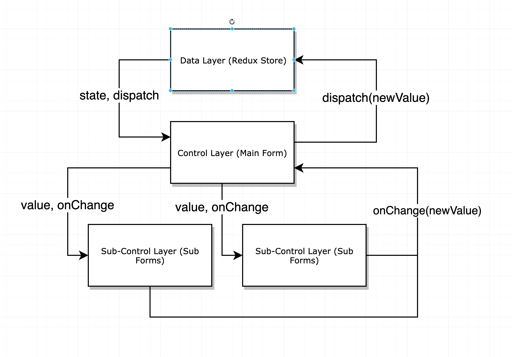

# 综合管理平台

## 安装说明

* 下载并安装 nodejs 链接:  https://nodejs.org/en/

* 使用npm install 命令安装npm包

* 使用npm run start:no-mock 启动本地项目

* 后端接口地址有变化需在 config/config.js 中修改对应接口的地址

## 其他说明

*此文档仅说明了此项目自定义的部分，主要文档请参考* <a href="http://pro.ant.design/docs/getting-started-cn">Ant Design Pro 官网</a>

## 目录

[代码规范](#代码规范)

[请求与响应拦截](#请求与响应拦截)

[常量](#常量)

[表单数据流](#表单数据流)

[自定义组件](#自定义组件)

## 代码规范
请在编辑器里安装prettier和eslint插件。此项目代码规定100个字符每行。eslint配置使用 Ant Design Pro 推荐规范，比较严格😁

## 请求与响应拦截
考虑到开发人员都对axios比较熟悉，此项目中的http库使用了axios。基础的请求和响应拦截设置在`/src/utils/request.js`文件中。`request.js` 里创建了一个axios实例并对该实例进行了一层封装。 `request`的用法和axios完全一样，`request.get("...")`等于`axios.get("...")`

## 常量

项目级别的常量都在`/src/constants.js`

## 表单数据流

不确定是不是最优解


## 自定义组件

项目级别共用的自定义组件都在`/src/components/`，和 Ant Design Pro 附带的组件放在一起。如果有新增加的组件，请放到这个文件夹中并在这里添加文档（不然谁知道怎么用啊！╮(╯_╰)╭）因为这些个组件都没有单元测试，所以用起来一定会有bug，到时候请找作者或自行修复=。=

### 动态表单域 `<DynamicField />`

> 生成动态表单域，基于antd的form组件, 提供了增加和删除域的功能

#### API
<table>
  <th>
    <tr>
      <td>prop</td>
      <td>type</td>
      <td>default</td>
      <td>comment</td>
    </tr>
  </th>

  <tr>
    <td>label</td>
    <td>string</td>
    <td>""</td>
    <td>当生成多项域的时候只有第一行会有标签</td>
  </tr>
  <tr>
    <td>wrapper</td>
    <td>React Element</td>
    <td>/</td>
    <td>可以是antd的 Col组件 也可以是自定义的wrapper</td>
  </tr>
  <tr>
    <td>children</td>
    <td>React Element</td>
    <td>required</td>
    <td>children是动态表单域的基本单位。只能传入一个children，可以是任何具有value以及onChange属性的组件，比如antd的Input和Select</td>
  </tr>
  <tr>
    <td>onChange</td>
    <td>function</td>
    <td>(value) => void </td>
    <td>可以用来监听表单域增加减少项或数据的改变</td>
  </tr>
  <tr>
    <td>value</td>
    <td>array</td>
    <td>[""]</td>
    <td>表单域的数据来源，如果使用 antd form 的 getFieldDecorator() 就不应该自行设置value属性</td>
  </tr>
  <tr>
    <td>options</td>
    <td>object</td>
    <td>{}</td>
    <td>动态表单中每个域的option属性，可用于传入每个域的validator等，与<a href="https://ant.design/components/form-cn/#getFieldDecorator(id,-options)-%E5%8F%82%E6%95%B0">getFieldDecorator(id, options)</a>中的options相同</td>
  </tr>
</table>

#### Usage

Parent 组件的 Form 中

```JSX
import DynamicField from '@/components/DynamicField';
...
{getFieldDecorator('spuNameOther')(
  <DynamicField label="SPU中文别名">
    <Input />
  </DynamicField>
)}
...
```

可选传入wrapper。wrapper 组件会给每个要渲染的表单域包裹一层。可以是antd的 `<Col />` 也可以是自定义的wrapper

```JSX
<DynamicField label="SPU中文别名" wrapper={<EvenlySplitRow />}>
  <Input />
</DynamicField>
```

### 表格选择器弹窗 `<ModalSelect />`

> 点击按钮打开modal，modal具有搜索框和展示table，点击table行进行单选，确定后按钮会被所选行的name替代，并增加编辑按钮


#### API

<table>
  <th>
    <tr>
      <td>prop</td>
      <td>type</td>
      <td>default</td>
      <td>comment</td>
    </tr>
  </th>

  <tr>
    <td>title</td>
    <td>string</td>
    <td>''</td>
    <td>Modal的标题</td>
  </tr>
  <tr>
    <td>columns</td>
    <td>[{},...]</td>
    <td>required</td>
    <td>弹窗中的表格的columns</td>
  </tr>
  <tr>
    <td>dataSource</td>
    <td>[{key: 'required', name: 'required',...},...]</td>
    <td>required</td>
    <td>弹窗中的表格的dataSource（每项必须要设置一个key，通常情况下可以使用数据的id作为key；，每项必须设置一个name，用来作为选中并确定弹窗关闭后表单显示的字面量）</td>
  </tr>
  <tr>
    <td>onSearch</td>
    <td>(value) => void</td>
    <td>null</td>
    <td>搜索框的回调，在每次modal打开时会自动调用</td>
  </tr>
   <tr>
    <td>onChange</td>
    <td>function</td>
    <td>(value) => void </td>
    <td>用来在父对象中（通常为getFieldDecorator）监听被选中项的变化</td>
  </tr>
  <tr>
    <td>value</td>
    <td>array</td>
    <td>[""]</td>
    <td>表单域的数据来源，如果使用 antd form 的 getFieldDecorator() 就不应该自行设置value属性</td>
  </tr>
  <tr>
    <td>loading</td>
    <td>boolean</td>
    <td>false</td>
    <td>modal内表格的loading状态</td>
  </tr>

</table>

#### Usage

```JSX
{getFieldDecorator('catalogId')(
  <ModalSelect
    title="关联后台类目"
    onSearch={this.handleCatalogSearch}
    dataSource={mapDataToCols(platformCatalogList)}
    columns={catalogColumns}
    loading={isCatalogLoading}
  />
)}
```

### 自动均匀分列 `<EvenlySplitRow />`

> 根据children的数量均匀分列。少于两个children时默认为两列。最少列数可通过minCols覆盖
> 
#### API

<table>
  <th>
    <tr>
      <td>prop</td>
      <td>type</td>
      <td>default</td>
    </tr>
  </th>

  <tr>
    <td>gutter 列间距</td>
    <td>number</td>
    <td>16(px)</td>
  </tr>
  <tr>
    <td>minCols 最少几列</td>
    <td>number</td>
    <td>2</td>
  </tr>
</table>

#### Usage

```JSX
import EvenlySplitedRow from '@/components/EvenlySplitedRow';

<EvenlySplitedRow gutter={16} minCols={2}>
  // children不一定要Form.Item，可以是任何由component组成的数组
  <Form.Item label="...">
    {/* ... */}
  </Form.Item>
  <Form.Item label="...">
    {/* ... */}
  </Form.Item>
</EvenlySplitedRow>
```
